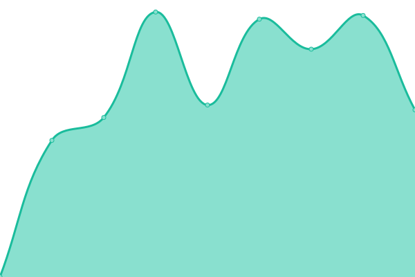
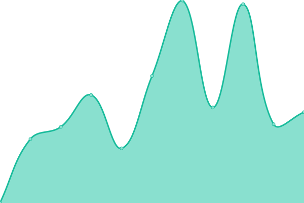

# [📈 Live Status](https://drakkr-team.github.io/igere-uptime): <!--live status--> **🟩 All systems operational**

This repository contains the open-source uptime monitor and status page for [Drakkar](drakkar.io), powered by [Upptime](https://github.com/upptime/upptime).

With [Upptime](https://upptime.js.org), you can get your own unlimited and free uptime monitor and status page, powered entirely by a GitHub repository. We use [Issues](https://github.com/drakkr-team/igere-uptime/issues) as incident reports, [Actions](https://github.com/drakkr-team/igere-uptime/actions) as uptime monitors, and [Pages](https://drakkr-team.github.io/igere-uptime) for the status page.

<!--start: status pages-->
<!-- This summary is generated by Upptime (https://github.com/upptime/upptime) -->
<!-- Do not edit this manually, your changes will be overwritten -->
<!-- prettier-ignore -->
| URL | Status | History | Response Time | Uptime |
| --- | ------ | ------- | ------------- | ------ |
|  [Dashboard](https://admin.igere.ch) | 🟩 Up | [dashboard.yml](https://github.com/drakkr-team/igere-uptime/commits/HEAD/history/dashboard.yml) | 

 810ms
     
 | 

<a href="https://drakkr-team.github.io/igere-uptime/history/dashboard">96.19%</a>
    

|  [Copro](https://app.igere.ch) | 🟩 Up | [copro.yml](https://github.com/drakkr-team/igere-uptime/commits/HEAD/history/copro.yml) | 

 959ms
     
 | 

<a href="https://drakkr-team.github.io/igere-uptime/history/copro">96.19%</a>
    

|  [Strapi](https://strapi.igere.ch) | 🟩 Up | [strapi.yml](https://github.com/drakkr-team/igere-uptime/commits/HEAD/history/strapi.yml) | 

 737ms
     
 | 

<a href="https://drakkr-team.github.io/igere-uptime/history/strapi">96.19%</a>
    

<!--end: status pages-->

[**Visit our status website →**](https://drakkr-team.github.io/igere-uptime)

## 📄 License

- Powered by: [Upptime](https://github.com/upptime/upptime)
- Code: [MIT](./LICENSE) © [Anand Chowdhary](https://anandchowdhary.com), supported by [Pabio](https://pabio.com)
- Data in the `./history` directory: [Open Database License](https://opendatacommons.org/licenses/odbl/1-0/)
